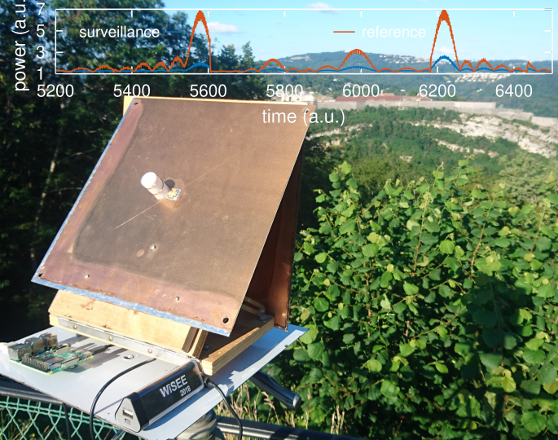
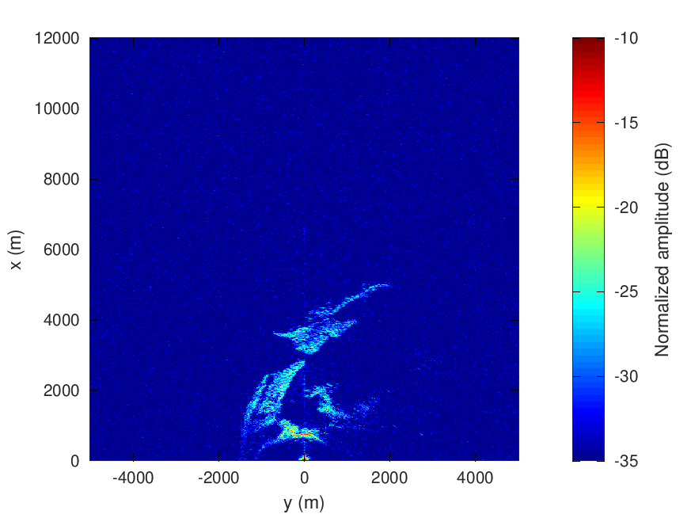
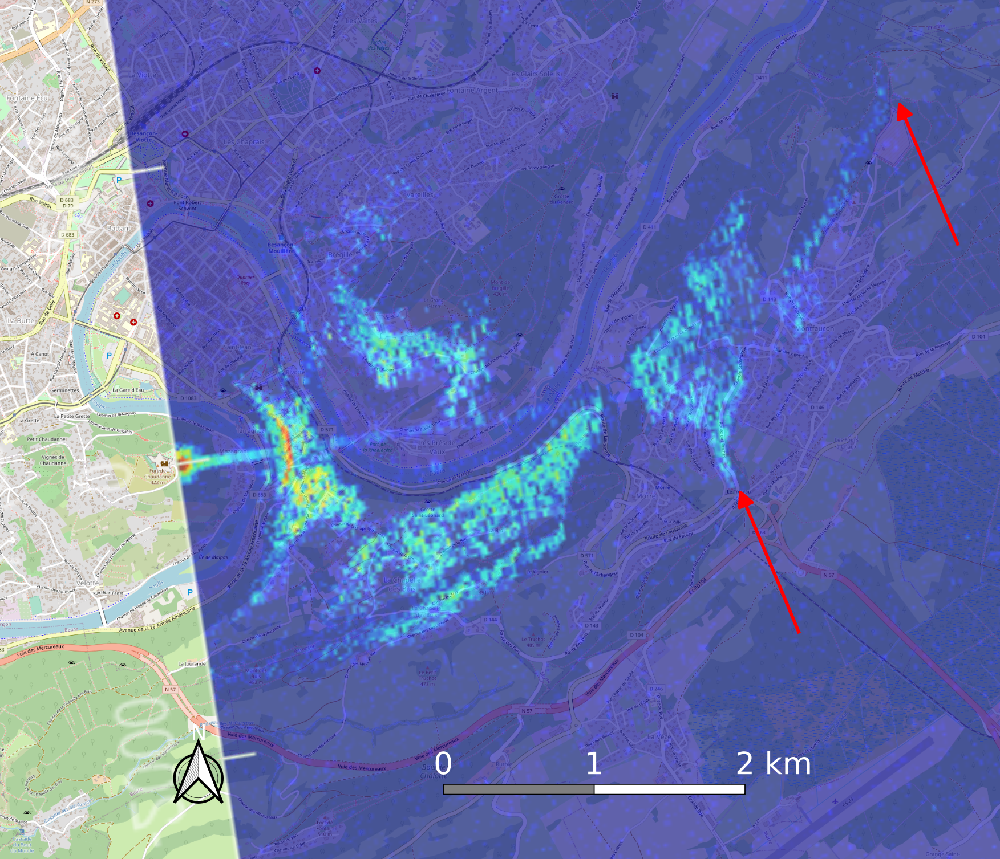

# sentinel1_pbr
Sentinel1 passive bistatic radar measurement using an Ettus Research B210 receiver and Raspberry Pi4.

Acquisition and processing flowchart:
* using the RPi4 acqusition program, sample 1 minute worth of data (the maximum that will fit in the
ramfs mounted on /tmp of a 8 GB RPi4) starting about 15 seconds prior to the date provided on ESA's
Sentinel Copernicus Hub website from a dataset collected 12 days prior to the current flight (repeat pass
period) and ending 15 seconds after the end-date. Each SLC/IW dataset is 30 second long on the ESA
web site and the RPi4 holding 1 minute worth of data, some margin is left for local time offset with
UTC due to clock drift.
* copy the two files from the RPi4 /tmp to the host computer for processing
* using processing/go1.m, plot the .bin files and extract res1.mat and res2.mat focusing only on relevant
signals where the strong pulses from Sentinel1 are visible. These should last 5 to 10 seconds out of the
1 minute dataset. After selecting the relevant data, the .bin files can be deleted to save space
* having selected the timeframe in which pulses from the reference (assumed ref1.mat) and surveillance (assumed
ref2.mat) have been cropped, execute processing/go4.m for range/azimuth compression and projecting
on the ground plane. Some tuning is needed for each execution of the script: 
  * select the relevant pulse amongst res1 and res2, as shown ll.41-44 of the script
  * define the elevation angle as provided for example on the [Heavens Above](https://www.heavens-above.com/) web site, as shown l.6 of the script
  * we attempt to identify the Pulse Repetition Interval by autocorrelating the reference signal: make sure that
the provided PRI (l.32) is credible. The first options are from Extra Wide (EW) swaths, the last three are
from Interferometric Wide (IW) swaths. The program should quit with an error if not PRI is found: these PRI
values have been extracted from decoding the raw Sentinel1 data as explained at https://github.com/jmfriedt/sentinel1_level0

Red arrows have been added to highlight the excellent match between detected echoes and geographical features seen
on the OpenStreeMap background chart.

This github repository provides the supporting material to "W. Feng, J.-M. Friedt, P. Wan, SDR-implemented passive 
bistatic SAR system using Sentinel-1 signal and its experiment results, submitted MDPI Remote Sensing (2021)"
