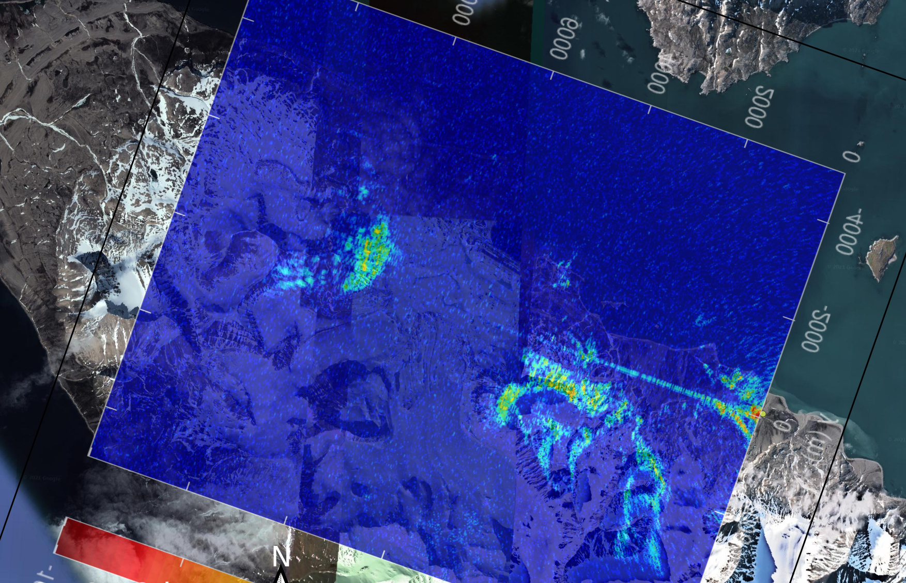
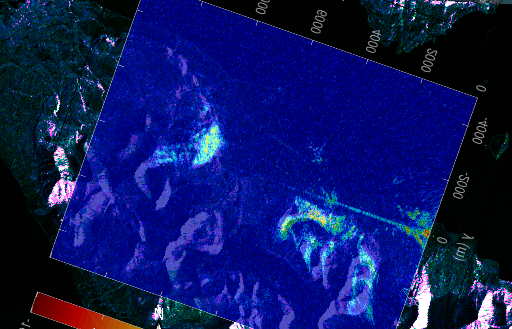
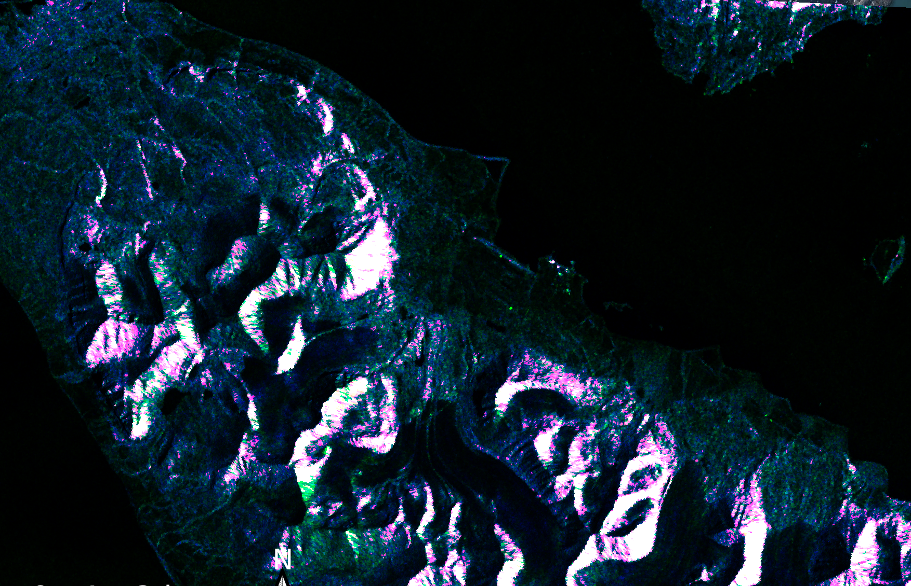

# Processing results
These figures demonstrate the expected result from running go4.m from datasets collected in various conditions.

We start by assessing that the proper PRI was selected by checking that the
datasets are aligned along the slow axis (abscissa):	

We check azimuth-range-compression in the alpha-beta plane dual to the spatial coordinates
following azimuth and range compression:

We check the valid projection in the satellite orbit-receiver plane:

Finally, the projection in the ground plane in (respectively) Clermont-Ferrand (France), Ny Alesund (Spitsbergen), 
Paris (France) and Besancon Planoise (France):

After projection on a background map:

The case of Ny Alesund is complemented with the comparison with monostatic reflection maps from
Sentinel1 data fetched from the ESA web site:

