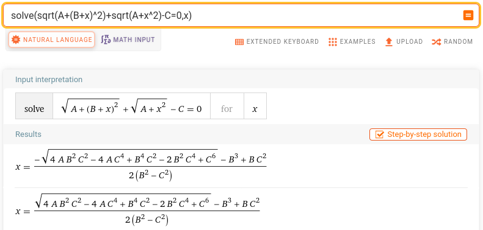

# Processing scripts
Processing script developed for GNU/Octave but should be running on Matlab as well.

The scripts aim at automating as much as possible but still require some manual tuning for each
dataset:
* go1.m: display the whole .bin files collected on the RPi4, select the duration in which pulses
from Sentinel1 are visible, and tune the parameters ll. 13-15 accordingly. I usually save the
solmax variable for future reference if needed
* having saved ref1 and ref2 (reference and suveillance datasets) from go1.m, run go4. After setting
the satellite elevation (l.6) and selecting a single pulse out of the ref datasets (ll.43-44), the
processing should be automated. When selecting the pulse, start at a high enough signal to noise
ratio, otherwise with too poor a SNR (e.g. starting at the first pulse notch) will make the
threshold detection of l.63 fail (we assume the received pulse to be at least twice as strong as
the background noise).

ll. 135-140 of go4.m might not look intuitive at first. They are the matrix implementation of the analytical
solution to the projection from the satellite orbit-receiver plane to the ground plane using the quite
amazing equation provided by Wolfram Alpha:

